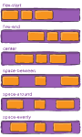

# Flexbox

## Flex:

Flexbox is a **one-dimensional layout** method for laying out items in **rows** or **columns**. Items flex to fill additional space and shrink to fit into smaller spaces. 

### Why Flexbox?

_**Before Flexbox, like floats and positioning:**_

#### Limits and Frustrates:

* Vertically centering a block of content inside its parent.
* Making all the **children of a container** take up an **equal** amount of the available **width/height**, regardless of how much width/height is available.
* Making all **columns in a multiple column** layout adopt the **same height** even if they contain a different amount of content.

### **Container**: Properties for the Parent \(flex container\)

```css
"display"
This defines a flex container;
Set a display value of "inline-flex" if you wish to lay out "inline items" as flexible boxes;

.container {
  display: flex; /* or inline-flex */
}


```

```css
flex-direction:
what direction the flexbox children are laid out in (default: row);
Defining the direction flex items are placed in the flex container;

.container {
  flex-direction: row | row-reverse | column | column-reverse;
}

```


When you have a **fixed amount of width or height** in your layout is that eventually your **flexbox children** will **overflow** their container, breaking the layout.

#### Wrapping


By **default**, **flex items will all try to fit onto one line**. You can change that and **allow the items to wrap** as needed with this property.

```css
.container{
  flex-wrap: nowrap | wrap | wrap-reverse;
}

> nowrap (default): all flex items will be on one line;
> wrap: flex items will wrap onto multiple lines, from top to bottom;
> wrap-reverse: flex items will wrap onto multiple lines from bottom to top;
```

#### flex-flow shorthand

```css
flex-flow: <‘flex-direction’> || <‘flex-wrap’>
The default value is row nowrap.

flex-direction: row;
flex-wrap: wrap;

with

flex-flow: row wrap;
```

#### Horizontal and vertical alignment


#### align-items


This defines the default behavior for **how flex items** are laid out along the cross axis on the current line.

```css
.container {
  align-items: stretch | flex-start | flex-end | center | baseline;
}

> stretch (default): stretch to fill the container (still respect min-width/max-width)
> flex-start: cross-start margin edge of the items is placed on the cross-start line
> flex-end: cross-end margin edge of the items is placed on the cross-end line
> center: items are centered in the cross-axis
> baseline: items are aligned such as their baselines align
```

 You can **override** the [`align-items`](https://developer.mozilla.org/en-US/docs/Web/CSS/align-items) behavior **for individual flex items** by applying the [`align-self`](https://developer.mozilla.org/en-US/docs/Web/CSS/align-self) property to them. For example, try adding the following to your CSS:

```css
button:first-child {
  align-self: flex-end;
}
```

#### align-content


This aligns a flex container's lines within when there is extra space in the cross-axis, similar to how `justify-content`aligns individual items within the main-axis.

```css
Note: this property has no effect when there is only one line of flex items;

.container {
  align-content: flex-start | flex-end | center | space-between | space-around | stretch;
}

> flex-start: lines packed to the start of the container
> flex-end: lines packed to the end of the container
> center: lines packed to the center of the container
> space-between: lines evenly distributed; the first line is at the start of the container while the last one is at the end
> space-around: lines evenly distributed with equal space around each line
> stretch (default): lines stretch to take up the remaining space
```


#### **justify-content**



 [`justify-content`](https://developer.mozilla.org/en-US/docs/Web/CSS/justify-content) **controls** where the **flex items** sit on the **main axis**.

This defines the alignment along the main axis. It **helps distribute extra free space** left over when either all the flex items on a line are inflexible, or are **flexible** but **have reached their maximum size**. It also exerts some control over the alignment of items when they overflow the line.

```css
.container {
  justify-content: flex-start | flex-end | center | space-between | space-around | space-evenly;
}

> flex-start (default): items are packed toward the start line
> flex-end: items are packed toward the end line
> center: items are centered along the line
> space-between: items are evenly distributed in the line; first item is on the start line, last item on the end line
> space-around: items are evenly distributed in the line with equal space around them. Note that visually the spaces aren't equal, since all the items have equal space on both sides. The first item will have one unit of space against the container edge, but two units of space between the next item because that next item has its own spacing that applies.
> space-evenly: items are distributed so that the spacing between any two items (and the space to the edges) is equal.
```


### Items: Properties for the children \(flex items\)

#### order


  The `order` property controls the order in which they appear in the flex container.

```css
.item {
  order: <integer>; /* default is 0 */
}
```

#### flex-grow


 If all items have `flex-grow` set to 1, the **remaining space** in the container **will be distributed equally to all children**.

```css
.item {
  flex-grow: <number>; /* default 0 */
}
```

#### flex-shrink

This defines the **ability for a flex item to shrink** if necessary.

```css
.item {
  flex-shrink: <number>; /* default 1 */
}

Negative numbers are invalid.
```

#### flex-basis

This **defines** the **default size** of an element **before the remaining space is distributed**. It can be a length \(e.g. 20%, 5rem, etc.\) or a keyword.

```css
.item {
  flex-basis: <length> | auto; /* default auto */
}
```

#### flex

 This is the **shorthand** for `flex-grow,` `flex-shrink` and `flex-basis` combined.

```css
.item {
  flex: none | [ <'flex-grow'> <'flex-shrink'>? || <'flex-basis'> ]
}

It is recommended that you use this shorthand property.
```

#### align-self


`For individual flex items`:   This allows the default alignment \(or the one specified by `align-items`\) to be overridden 

```css
.item {
  align-self: auto | flex-start | flex-end | center | baseline | stretch;
}
```


> Note that `float`, `clear` and `vertical-align` have no effect on a flex item.


### Nested flex boxes

> ```text
> section - article
>           article
>           article - div - button   
>                     div   button
>                     div   button
>                           button
>                           button
> ```

Let's look at the code we've used for the layout.

```css
section {
  display: flex;
}

article {
  flex: 1 200px;
}

article:nth-of-type(3) { // nested flex
  flex: 3 200px;
  display: flex;
  flex-flow: column;
}

article:nth-of-type(3) div:first-child {
  flex:1 100px;
  display: flex;
  flex-flow: row wrap;
  align-items: center;
  justify-content: space-around;
}

button {
  flex: 1 auto;
  margin: 5px;
  font-size: 18px;
  line-height: 1.5;
}
```


